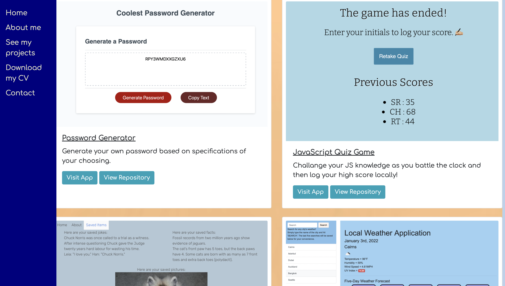

# Promising Portfolio

## Link to deployed site

[Click here to view my portfolio](https://chandrapanda.github.io/promising-portfolio/)

## Description

This portfolio showcases my skills as an employee and a developer. Users can view my work and find contact information by clicking links on my page. Prospective employers and contracters may view samples of my work and select links to view deployed applications and their functionality.

## Table of Contents

1. [Installation](#installation)
2. [Usage](#usage)
3. [Contributing](#contributing)
4. [Screenshots](#screenshots)
5. [Questions](#questions)

## Installation

No required installation steps at this time.

## Usage

The page will collapse when used on a smaller screen using a media query.

## Contributing

All contributions by creator: Chandra Holt

## Screenshots

### GitHub

[GitHub](https://www.github.com/chandrapanda)

### Email

chandra_holt@hotmail.com

## License

[This application is licensed under Mozilla](https://opensource.org/licenses/MPL-2.0)
